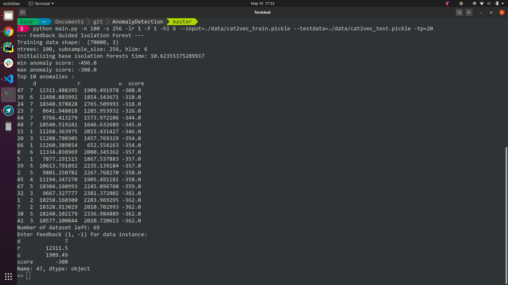

# AnomalyDetection

## Isolation forest usage

```bash
$ python main.py --help
usage: main.py [-h] [-n NTREES] [-s SUBSAMPLESIZE] [-lr LRATE] [-tp TOP]
               [-td TESTDATA] [-ec EXCLUDECOLIDX] -f FOREST -hl HLIM -i INPUT

testing feedback guided isolation forest model

optional arguments:
  -h, --help            show this help message and exit
  -n NTREES, --ntrees NTREES
                        number of trees in the forest, default 100
  -s SUBSAMPLESIZE, --subsamplesize SUBSAMPLESIZE
                        sampling rate for each tree, default 256
  -lr LRATE, --lrate LRATE
                        learning rate of mirror descent algorithm
  -tp TOP, --top TOP    print top anomalies in each loop of iff
  -td TESTDATA, --testdata TESTDATA
                        path of the test pickle file
  -ec EXCLUDECOLIDX, --excludecolidx EXCLUDECOLIDX
                        columns to exclude for training

required named arguments:
  -f FOREST, --forest FOREST
                        0 for normal iforest, otherwise feedback iforest
  -hl HLIM, --hlim HLIM
                        height limit for tree
  -i INPUT, --input INPUT
                        path of the input pickle file

```

Some example usages:



